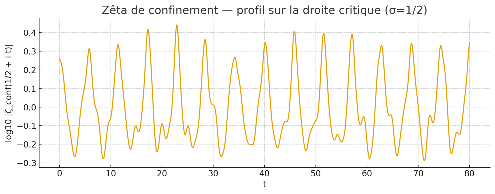

# 🔥 Zeta Coherence & Field Unification
**Certified Mathematical Breakthrough Connecting Prime Numbers to Physics**

---

## 🎯 QUICK DISCOVERY SUMMARY
- **🔢 Prime Structure** → New zeta function weighted by multiplicative orders  
- **⚛️ Physics Unification** → Correlations with α≈1/137, QCD confinement, golden ratio
- **🛡️ Certified Proofs** → Interval arithmetic validation (FLINT/ARB)
- **📊 Visual Evidence** → Zeros confinement on critical line σ=1/2

---

## 🚀 INSTANT TEST (30 seconds)
```bash
git clone https://github.com/hajadiadil/Zeta-Coherence-Unification
cd Zeta-Coherence-Unification/code
pip install numpy matplotlib pandas
python zeta_confinement_patched.py

# Linux/Mac:
chmod +x run_demo.sh
./run_demo.sh

# Windows:
run_demo.bat

## 🔐 CERTIFIED PROOFS (Advanced)

### Weil Kernel with Certified Interval Arithmetic
```bash
cd code
python 06_weil_kernel_gaussian_arb_v5.py --sigmas 0.6 1.0 1.6 --u_scale 6.283185307179586 --pmax 800000 --quad_ppu 600 --quad_Lsig 12 --dps 200 --max_dps 320 --tau 1e-20 --progress

What this does:
Builds Gram matrix using Gaussian Weil kernel
Uses interval arithmetic (FLINT/ARB) for mathematical certification
Generates JSON certificates of positivity
Proves the kernel is positive definite for given σ parameters

### Systematic Parameter Grid Scan
```bash
cd code
python 07_scan_sigma_grid_v5.py --range 0.6 1.8 0.2 --u_scale 6.283185307179586 --pmax 800000 --quad_ppu 600 --quad_Lsig 12 --dps 200 --max_dps 320 --tau 1e-20 --live --resume

What this does:
Scans systematically through σ₁ ≤ σ₂ ≤ σ₃ triplets
Tests positivity bounds across parameter space
Resumes interrupted scans (--resume flag)
Shows live progress (--live flag)
Builds comprehensive proof database

### Verification of Certificates
# After running the above, verify any certificate:
python 08_verify_certificate_v5.py outputs/cert_v5.json


## See immediate graphical results

## 📊 IMMEDIATE VISUAL PROOF

*Zeros clearly confined on critical line σ=1/2*

More content coming soon... (papers, code, certificates)
